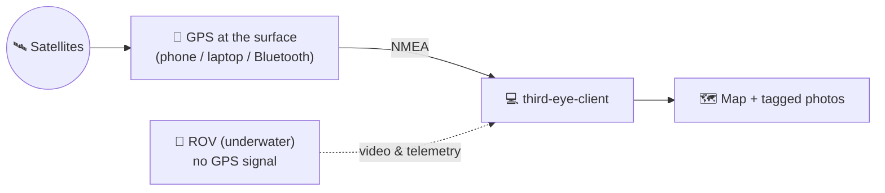

# 🧭 Operating Guide — Start Here

**A plain-English, step-by-step manual for using third-eye-client with a Chasing underwater ROV.**

If you have never used this app before, read this page top to bottom. You do not need to understand the code.

> [!IMPORTANT]
> Follow the steps **in order**. Do not skip.

> [!TIP]
> Looking for deep technical detail (build steps, exact network settings, full feature list)? See the [README](README.md). This guide keeps things simple.

## 📑 Contents

1. [What this app does](#-what-this-app-does)
2. [What you need](#-what-you-need-before-you-start)
3. [Part 1 — Connect to the Chasing M2S](#-part-1--connect-to-the-chasing-m2s)
4. [Part 2 — Watch video and take photos](#-part-2--watch-video-and-take-photos)
5. [Part 3 — GPS on the map](#-part-3--gps-on-the-map-the-nmea-part)
6. [When something is broken](#-when-something-is-broken)

---

## 🎯 What this app does

It shows you the **live camera** from the ROV, lets you **take photos/videos**, and puts your position on a **map** — even though the ROV itself is underwater and cannot see GPS satellites.

| 🎥 See | 📸 Capture | 🗺️ Locate |
|---|---|---|
| Live camera with depth, heading and battery on top | Photos and videos, each tagged with where you were | Your position on a map, from a GPS at the surface |

## 🧰 What you need before you start

- [ ] A laptop running **macOS**, **Windows** or **Linux**. (Most field testing so far has been on macOS and Windows, but Linux is a first-class target and works too.)
- [ ] Your **Chasing M2S ROV** and its cable reel / controller box.
- [ ] **One of these** to connect the laptop to the ROV — **either one works on any operating system**:
  - the ROV's **Wi‑Fi** (easiest), **or**
  - a **USB‑to‑Ethernet adapter** and the ROV's network cable.
- [ ] *Optional, for GPS on the map:* your **phone** with a free GPS app, or a Bluetooth GPS device.

---

## 🔌 Part 1 — Connect to the Chasing M2S

### Step 0: Read the ROV's own manual first

Before touching the app, read the **operation manual that came with your Chasing M2S** (the manufacturer's booklet / PDF). Learn how to:

- charge and power the ROV on/off,
- attach the tether cable safely,
- turn the ROV's Wi‑Fi on.

> [!NOTE]
> The app only *talks* to the ROV. The ROV still has to be powered on and set up the way its own manual describes.

### Step 1: Connect your laptop to the ROV

**Both connection types work on every operating system** — macOS, Windows and Linux. Pick whichever is easier for you; you do **not** need both.

> [!NOTE]
> **The app doesn't care how you connect.** It talks to the ROV the same way over Wi‑Fi or a wired USB link, so if a setup works over Wi‑Fi it works over a USB (wired data) connection too — and the other way around. The connection type never changes what the app can do.

<b>Option A — Wi‑Fi (easiest)</b>

1. On the ROV, turn on its Wi‑Fi (see the ROV manual).
2. On your laptop, open Wi‑Fi settings and **connect to the ROV's Wi‑Fi network**, exactly like joining any home/office Wi‑Fi. Your laptop is now on the ROV's network.

<b>Option B — USB‑to‑Ethernet cable</b>

1. Plug a **USB‑to‑Ethernet adapter** into your laptop.
2. Plug the **ROV's network cable** into that adapter.
3. Give the adapter a fixed address so it can find the ROV:

   | Setting | Value |
   |---|---|
   | ROV address | `192.168.1.88` |
   | **Your adapter's IP** | `192.168.1.103` |
   | Subnet mask | `255.255.255.0` |

   Full click‑by‑click steps are in the README: [Network setup (USB Ethernet to ROV)](README.md#-network-setup-usb-ethernet-to-rov).

### Step 2: Press "Recalibrate" and let the app figure it out

You do **not** have to tell the app whether you used Wi‑Fi or the cable. It checks for you.

1. In the app, click **Configuration** in the left sidebar.
2. Click the **Recalibrate ROV network** button.
3. Wait a few seconds. Read the message it shows you.

**What "Recalibrate" does, in plain terms:**

- **Wi‑Fi comes first, on every OS.** Wi‑Fi is the primary, first‑supported way to reach the ROV, so if your laptop is on the ROV's Wi‑Fi the app uses it.
- **Then everything else.** If you're on the USB cable instead, Recalibrate detects it and prepares the wired video route.

> [!NOTE]
> On a Mac it may ask for your **admin password** once — this is normal and only needed to set up the video stream. Type it in.

If the message says it found your ROV / interface, you're connected. 🎉

### ✅ Did it work? Quick check

- Go to **Live Stream** in the sidebar. You should see live video within a few seconds.
- If you don't, see [When something is broken](#-when-something-is-broken) below.

---

## 📸 Part 2 — Watch video and take photos

Once connected:

| Screen | What it does |
|---|---|
| **Live Stream** | Shows the camera full‑screen, with depth, heading, battery, etc. overlaid on top |
| **Media** | The ROV's photos/videos — preview, download to your laptop, or delete them |

Taking a photo also **saves where you were** (depth, heading, GPS position) so every shot is tagged. That position comes from GPS — which is Part 3.

---

## 🛰️ Part 3 — GPS on the map (the "NMEA" part)

> [!IMPORTANT]
> **This is the whole point of the project, so read it slowly.**

### The problem

GPS works using **radio signals from satellites**. Radio signals **cannot travel through water**. So the moment the ROV goes underwater, it is **blind to GPS** — it has no idea where it is on the map.

### The fix: get GPS from the surface

We get the position from something that **stays at the surface** (in the open air, where it can see satellites) and hand that position to the app. The app then uses it to center the map and to tag your photos.

"**NMEA**" is just the **standard language that GPS devices speak** to report their position. This app can listen to that language from several places, so you can use whatever you have.

### Your options (pick one)

#### 1️⃣ Your laptop's own GPS (simplest, if it has one)

| OS | What is used |
|---|---|
| 🍎 **macOS** | Built‑in Location Services (it will ask permission once) |
| 🪟 **Windows** | Windows Location Services |

Keep the laptop at the surface / near a window / outdoors for a good fix.

#### 2️⃣ Your phone as a GPS (most common)

Install a free GPS app on your phone, keep the phone at the surface (e.g. in a dry bag on the boat), then open the **Phone GPS** screen in the app and choose a **Connection mode**:

| Connection mode | How it works | Works with |
|---|---|---|
| **TCP Listen** | The app *waits* and your phone app *connects to the laptop*. The app shows you the address/port to type into the phone app. | GPS2IP, GPSd Forwarder |
| **Connect to TCP Server** | The *opposite*: your phone app runs a server and the app *dials into it*. You type the phone's IP address and port into the app. | ShareGPS, GPS Tether Server |
| **Bluetooth** | Pair a Bluetooth GPS device (or a phone GPS app that offers Bluetooth) with your laptop first, then pick it from the list. | Bluetooth GPS receivers, phone apps with Bluetooth |

> [!TIP]
> Leave **GPS protocol** on **NMEA** unless your device specifically needs **TAIP**.

### How to know it's working

On the **Device Map** screen, look at the small **NMEA** badge (bottom‑left):

| Badge | Meaning |
|---|---|
| 🟢 **OK** (green) | You have a position |
| ⏳ `..` | Still connecting |
| ⚪ `--` | Off |

When you have a fix, the map recenters on your position and new photos get tagged with it.

---

## 🆘 When something is broken

Try these first, in order:

1. Is the **ROV powered on**? (Check its own manual.)
2. Press **Recalibrate ROV network** again (Configuration screen).
3. **Cable users:** double‑check your adapter's address is `192.168.1.103`.
4. **Video won't play on a Mac:** restart the stream and **enter the admin password** when asked.

A full symptom → cause → fix table is in the README: [Troubleshooting](README.md#troubleshooting) and [Verifying connectivity](README.md#verifying-connectivity).

---

## 📚 Want more detail?

- **[README](README.md)** — full feature list, exact network setup, build instructions and the troubleshooting tables.
